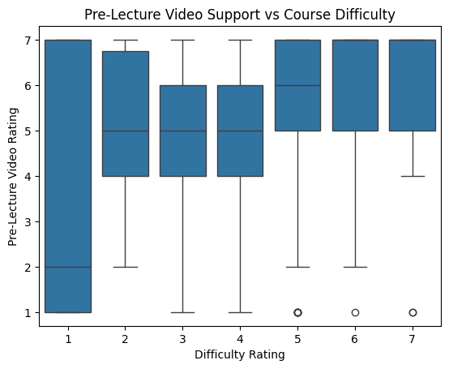
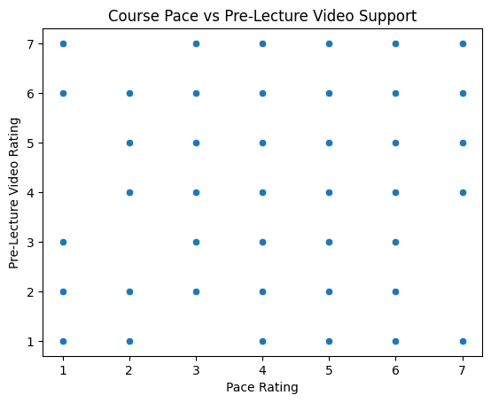

---
# Do not edit the text between these lines!
layout: default
---

# COMP110 Data Analysis Project

## Overview

This project analyzes student survey data from COMP110 to explore how course difficulty and pace influence student learning preferences. The goal is to identify ways to improve the course experience using data-driven insights.

---

## Research Question

Should COMP110 add more pre-lecture videos to improve student understanding?

---

## Data & Methods

The data comes from an anonymized student survey. I used Python to process the data and created visualizations using seaborn. The analysis focuses on relationships between:
- Course difficulty
- Course pace
- Student understanding
- Interest in pre-lecture videos

---

## Key Findings

- Most students rated pre-lecture videos highly, indicating strong interest.
- Students who found the course more difficult also tended to rate pre-lecture videos as more helpful.
- Students who felt the course pace was fast showed greater interest in pre-lecture videos.

---

## Visualizations

### Chart 1: Pre-Lecture Video Ratings

This chart shows that most students rated pre-lecture videos highly, with many responses at 5–7. This indicates strong overall interest in using videos as a learning resource.

### Chart 2: Difficulty vs Pre-Lecture Videos

I used Python to clean and analyze the data. I converted survey responses into numeric values and used pandas to organize the data into tables. Then, I created visualizations using seaborn to explore relationships between variables.

### Chart 3: Pace vs Pre-Lecture Videos

---While creating these videos may require additional time and effort from instructors, the potential benefits for student understanding and success outweigh these costs.

## Conclusion

The data supports adding pre-lecture videos as a helpful resource for students. These videos could improve understanding, especially for students who find the course difficult or fast-paced. While creating these videos may require additional effort from instructors, the potential benefits for student learning make this a valuable improvement.

---

## About Me

I am a student in COMP110 interested in using data to understand and improve learning experiences.